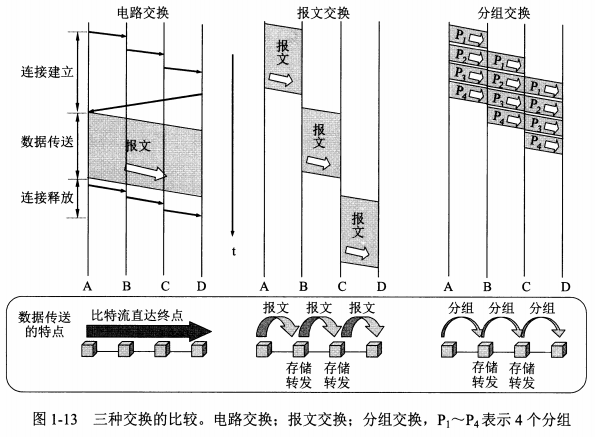
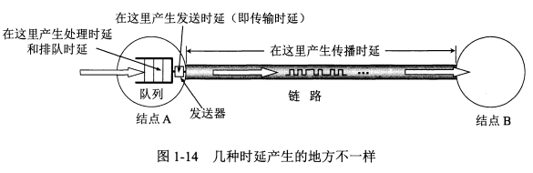
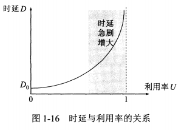
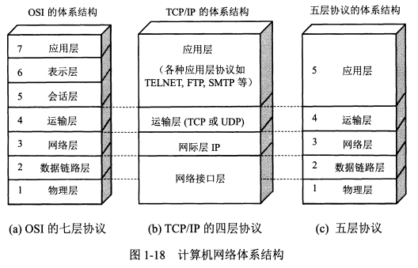
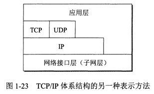
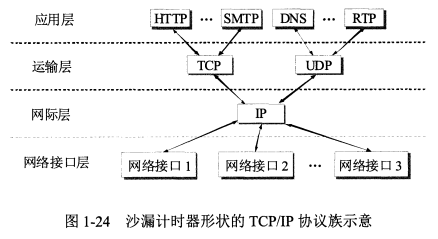

* content
{:toc}
《计算机网络(第七版)-谢希仁》 第1章 概述

计算机网络整体概述，了解概念

<!--more-->

## 互联网概述

### 网络的网络

**计算机网络**(简称为**网络**)由若干**结点(node)**和连接这些结点的**链路(link)**组成。网络中的结点可以是计算机、集线器、交换机或路由器等。网络之间还可以通过罗尤其互连起来，构成一个范围更大的计算机网络。称为**互连网**(internetwork或internet)。

网络把许多计算机连接在一起，而互连网则把许多网络通过路由器连接在一起。与网络相连的计算机常称为主机。

## 互联网的组成

### 边缘部分

连接在互联网上的所有的主机，用户直接使用的，这些主机又称为**端系统(end system)**

* **客户-服务器方式** : 客户(client)和服务器(server)都是指通信中所涉及的两个应用进程，客户是服务请求方，服务器是服务提供方。
* **对等连接方式** : (peer-to-peer,简写为P2P)只要两台主机都运行了对等连接软件(P2P软件)，它们就可以 进行平等的、对等连接通信。

### 核心部分

为边缘部分提供服务的(提供连通性和交换)

**路由器**(router)是实现**分组交换**(packet switching)的关键构件，其任务是转发收到的分组。

#### 电路交换

建立连接(占用通 信资源) -> 通话(一直占用通信资源释放连接) -> 归还通信资源，三个步骤的交换方式。在通话的全部时间内，通话的两个用户始终占用端到端的通信资源。

#### 分组交换

分组交换则采用存储转发技术。通常我们把要发送的整块数据称为一个报文(message)。在发送报文之前，先把较长的报文划分成为一个个更小的等长数据段，例如，每个数据段为1024 bit。在每一个数据段前面，加上一些由必要的控制信息组成的首部(header)后，就构成了一个分组(packet)。分组又称为“包”，而分组的首部也可称为“包头”。分组的首部包含了诸如目的地址和源地址等重要控制信息，每一个分组能在互联网中独立地选择传输路径，并被正确地交付到分组传输的终点。

| 优点   | 所采用的手段                             |
| ---- | ---------------------------------- |
| 高效   | 在分组传输的过程中动态分配传输带宽，对通信链路是逐段占用       |
| 灵活   | 为每一个分组独立地选择最合适的转发路由                |
| 迅速   | 以分组作为传送单位，可以不先建立连接就能向其他主机发送分组      |
| 可靠   | 保证可靠性的网络协议；分布式多路由的分组交换网，使网络有很好的生存性 |

#### 三种交换方式对比

* 电路交换——整个报文的比特流连续地从源点直达终点，好像在一个管道中传送。
* 报文交换——整个报文先传送到相邻结点，全部存储下来后查找转发表，转发到下一 个结点。
* 分组交换——单个分组（这只是整个报文的一部分）传送到相邻结点，存储下来后查 找转发表，转发到下一个结点。

若要连续传送大量的数据，且其传送时间远大于连接建立时间，则电路交换的传输速率较快。报文交换和分组交换不需要预先分配传输带宽，在传送突发数据时可提高整个网络的信道利用率。由于一个分组的长度往往远小于整个报文的长度，因此分组交换比报文交换的时延小，同时也具有更好的灵活性。

## 计算机网络的类别

### 按照作用范围分类

* **广域网WAN (Wide Area Network)** ：几十到几千公里
* **城域网MAN (Metropolitan Area Network)** ：5〜50 km
* **局域网LAN (Local Area Network)** ：局限在较小的范围（如1 km左右）
* **个人区域网PAN (Personal Area Network)** 

### 按照网络使用者分类

* **公用网(public network)**
* **专用网(private network)**

## 计算机网络的性能

### 性能指标

#### 1. 速率

**速率**指的是数据的**传送速率**，它也称为**数据率(data rate)** 或**比特率(bit rate)**。速率是计算机网络中最重要的一个性能指标。速率的单位是bit/s (比特每秒)(或b/s，有时也写为bps，即bit per second)。当数据率较高时，就常常在bit/s的前面加上一个字母，例如`k(kilo) = 10^3，M(Mega) = 10^6,G(Giga) = 10^9`。当提到网络的速率时，往往指的是**额定速率**或**标称速率**，而并非网络实际上运行的速率。

#### 2. 带宽

**带宽(bandwidth)**有两种不同的意义：

* 指某个信号具有的频带宽度，表示某信道允许通过的信号频带范围就称为该信道的带宽 (或通频带)，单位是赫兹。
* 用来表示网络中某通道传送数据的能力，在单位时间内网络中的某信道所能通过的“最高数据率”，单位bit/s。

在“带宽”的上述两种表述中，前者为频域称谓，而后者为时域称谓，本质是相同的，一条通信链路的“带宽”越宽，其所能传输的“最高数据率”也越高。

#### 3. 吞吐量

**吞吐量(throughput)**表示在单位时间内通过某个网络(或信道、接口)的实际的数据量。其额定速率也是该以太网的吞吐量的绝对上限值。有时吞吐量还可用每秒传送的字节数或帧数来表示。

#### 4. 时延

时延(delay或latency)是指数据(一个报文或分组，甚至比特)从网络(或链路)的一 端传送到另一端所需的时间。

* 发送时延

发送时延(transmission delay)是主机或路由器发送数据巾贞所需要的时间 = 数据帧长度(bit) / 发送速率(bit/s)

* 传播时延

传播时延(propagation delay)是电磁波在信道中传播一定的距离需要花费的时间 = 信道长度(m) / 电磁波在信道上的传播速率(m/s)

* 处理时延
* 排队时延

总时延  =发送时延 + 传播时延 + 处理时延 + 排队时延

#### 5. 时延带宽积

时延带宽积 = 传播时延 `X` 带宽，又称为以比特为单位的链路长度。对于一条正在传送数据的链路，只有在代表链路的管道都充满比特时，链路才得到充分的利用。

#### 6. 往返时间RTT

发送时间 = 数据长度 / 发送速率

等待确认信息后继续发送数据

有效数据率 = 数据长度 / (发送时间 + RTT)

往返时间还包括各中间结点的处理时延、排队时延以及转发数据时的发送时延。

#### 7. 利用率

**利用率**有信道利用率和网络利用率两种。信道利用率指出某信道有百分之几的时间是被利用的(有数据通过)。网络利用率则是全网络的信道利用率的加权平均值。信道利用率并非越高越好。这是因为根据排队论的理论，当某信道的利用率增大时，该信道引起的时延也就迅速增加。一些拥有较大主干网的ISP通常控制信道利用率不超过 50%。

网络当前时延 = 网络空闲时的时延 / (1 - 网络利用率)

## 计算机网络体系结构

计算机网络的各层及其协议的集合就是网络的体系结构(architecture)，或者说，计算机网络的体系结构就是这个计算机网络及其构件所应完成的功能的精确定义。

### 具有五层协议的体系结构

OSI的七层协议体系结构概念清楚，理论网站，但是它复杂不实用。TCP/IP体系结构则不同，但它现在却得到了非常广泛的应用。TCP/IP是一个四层的体系结构，它包含应用层、运输层、网际层和网络接口层（用网际层这个名字是强调这一层是为了解决不同网络的互连问题)。不过从实质上讲，TCP/IP只有最上面的三 层，因为最下面的网络接口层并没有什么具体内容。学习计算机网络的原理时往往釆取折中的办法，即综合OSI和TCP/IP的优点，釆用一种只有五层协议的体系结构。有时为了方便，也可把最底下两层称为网络接口层。

#### 1. 应用层(application layer)

应用层是体系结构中的最高层。应用层的任务是**通过应用进程间的交互来完成特定网络应用**。应用层协议定义的是**应用进程间通信和交互的规则**。这里的进程就是指主机中正在 运行的程序。对于不同的网络应用需要有不同的应用层协议。在互联网中的应用层协议很多，如域名系统DNS，支持万维网应用的HTTP协议，支持电子邮件的SMTP协议等。我们把应用层交互的数据单元称为**报文(message)**。

#### 2. 运输层(transport layer)

运输层的任务就是负责向两台主机中**进程之间的通信**提供通用的**数据传输服务**。运输层有复用和分用的功能。复用就是**多个应用层进程可同时使用下面运输层的服务**，分用是运输层把收到的信息**分别交付**上面应用层中的相应进程。

* **传输控制协议TCP (Transmission Control Protocol)** ：提供面向连接的、可靠的数据传输服务，其数据传输的单位是**报文段(segment)**。
* **用户数据报协议UDP (User Datagram Protocol)**：提供无连接的、**尽最大努力(best-effort)**的数据传输服务(不保证数据传输的可靠性)，其数据传输的单位是用户数据报。

#### 3. 网络层(network layer)

网络层负责为**分组交换**网上的不同**主机**提供通信服务。在发送数据时，网络层把运输层产生的报文段或用户数据报封装成分组或包进行传送。在TCP/IP体系中，由于网络层使用IP协议，因此分组也叫做**IP数据报**，或简称为**数据报**。

无论在哪一层传送的数据单元，都可笼统地用“分组”来表示。

网络层的另一个任务就是要选择合适的路由，使源主机运输层所传下来的分组，能够通过网络中的路由器找到目的主机。

网络层也叫做网际层或IP层。

#### 4. 数据链路层(data link layer)

数据链路层常简称为链路层。在两个相邻结点之间传送数据时，数据链路层将网络层交下来的数据报**组装成帧(framing)**，在两个相邻结点间的链路上**传送帧(frame)**。每一帧包括数据和必要的**控制信息**(如同步信息、地址信息、差错控制等)。

#### 5. 物理层(physical layer)

在物理层上所传数据的单位是比特。物理层要考虑用多大的电压代表“1”或“0”，以及接收方如何识别出发送方所发送的比特。物理层还要确定连接电缆的插头应当有多少根引脚以及各引脚应如何连接。传递信息所利用的一些物理媒体并不在物理层协议之内而是在物理层协议的下面。

### 实体、协议、服务、和服务访问点

* **实体**：任何可发送或接收信息的硬件或软件进程
* **协议**： 控制两个对等实体(或多个实体)进行通信的规则的集合。协议的语法方面的规则定义了所交换的信息的格式，而协议的语义方面的规则就定义了发送者或接收者所要完成的操作。
* 在协议的控制下，两个对等实体间的通信使得本层能够向上一层提供服务。要实现本层协议，还需要使用下面一层所提供的服务。协议是控制对等实体之间通信的规则，服务是由下层向上层通过层间接口提供的，只有那些能够被高一层实体“看得见”的功能才能称之为“服务”。
* **服务访问点 SAP (Service Access Point)**：在同一系统中相邻两层的实体进行交互（即交换信息）的地方

OSI参考模型把对等层次之间传送的数据单位称为该层的**协议数据单元PDU (Protocol Data Unit)**。OSI把层与层之间交换的数据的单位称 **为服务数据单元SDU (Service Data Unit)**，可以是多个SDU 合成为一个PDU,也可以是一个SDU划分为几个PDU。

### TCP/IP的体系结构

TCP/IP协议族表明： TCP/IP协议可以为各式各样的应用提供服务(所谓的everything over IP)，同时TCP/EP协议也允许IP协议在各式各样的网络构成的互联网上运行(所谓的IP over everything)。

