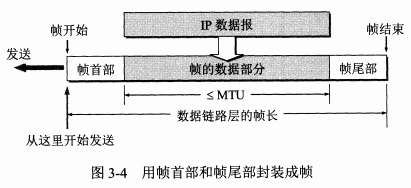
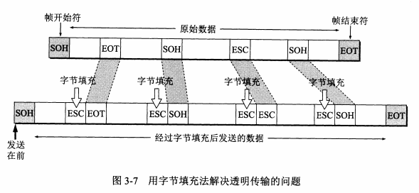
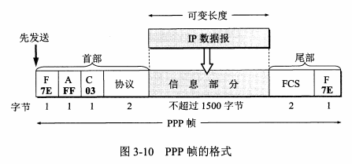
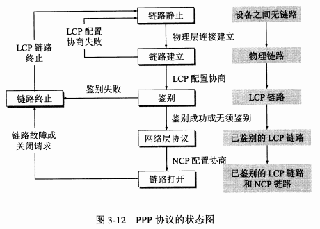
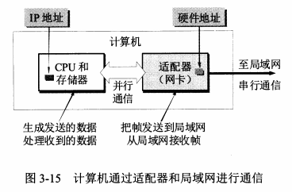
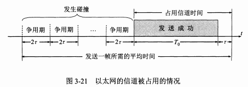
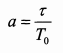
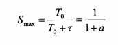
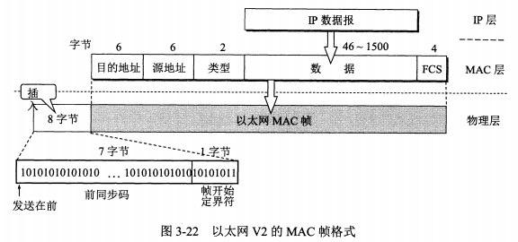

* content
{:toc}
《计算机网络(第七版)-谢希仁》 第3章 数据链路层

偏向底层，了解为主

<!--more-->

数据链路层主要使用**点对点信道**和**广播信道**两种类型的信道。

本章的重点内容有：

* 数据链路层的点对点信道和广播信道的特点，以及这两种信道所使用的协议(PPP 协议以及CSMA/CD协议)的特点。
* 数据链路层的三个基本问题：封装成帧、透明传输和差错检测。
* 以太网MAC层的硬件地址。
* 适配器、转发器、集线器、网桥、以太网交换机的作用以及使用场合。

## 使用点对点信道的数据链路层

### 数据链路和帧

**链路(link)**：也称为物理链路，是从一个结点到相邻结点的一段物理线路(有线或无线)，而中间没有任何其他的交换结点。

**数据链路(data link)**：也称为逻辑链路，除了必须有一条物理线路外，还必须有一些必要的通信协议来控制这些数据的传输。若把实现这些协议的硬件和软件加到链路上，就构成了数据链路。

**帧**：点对点信道的数据链路层的协议数据单元。

点对点信道的数据链路层在进行通信时的主要步骤如下：

1. 结点A的数据链路层把网络层交下来的IP数据报添加首部和尾部封装成帧。
2. 结点A把封装好的帧发送给结点B的数据链路层。
3. 若结点B的数据链路层收到的帧无差错，则从收到的帧中提取出IP数据报交给上面的网络层，否则丢弃这个帧。

### 三个基本问题

#### 封装成帧(framing)

在一段数据的前后分别添加首部和尾部，这样就构成了一个帧。每一种链路层协议都规定了所能传送的帧的数据部分长度上限——最大传送单元MTU (Maximum Transfer Unit)

#### 透明传输

表示无论什么样的比特组合的数据，都能够按照原样没有差错地通过这个数据链路层。

#### 差错检测

目前在数据链路层广泛使用了循环冗余检验CRC(Cyclic Redundancy Check)的检错技术。

在发送端，先把数据划分为组，假定每组k个比特。现假定待传送的数据101001 (k = 6)。CRC运算就是在数据M的后面添加供差错检测用的n位冗余码，然后构成一个帧发送出去，一共发送(k + n)位。冗余码常称为帧检验序列FCS (Frame Check Sequence)。

在数据链路层若仅仅使用循环冗余检验CRC差错检测技术，则**只能做到对帧的无差错接受**，即：“凡是接收端数据链路层接受的帧，我们都能以非常接近于1 的概率认为这些帧**在传输过程中**没有产生差错”。接收端丢弃的帧虽然曾收到了，但最终还是因为有差错被丢弃，即没有被接受。以上所述的可以近似地表述为：“凡是接收端数据链路层接受的帧均无差错”。

此外，还会出现**传输差错**：帧丟失、帧重复、帧失序。

对于通信质量良好的有线传输链路，数据链路层协议不使用确认和重传机制，即不要求数据链路层向上提供可靠传输的服务。如果在数据链路层传输数据时出现了差错并且需要进行改正，那么改正差错的任务就由上层协议(例如，运输层的TCP协议)来完成。

## 点对点协议PPP(Point-to-Point Protocol)

### PPP协议的特点

互联网用户通常都要连接到某个ISP才能接入到互联网。PPP协议就是用户计算机和ISP进行通信时所使用的数据链路层协议。

**PPP协议的组成**：

* 一个将IP数据报封装到串行链路的方法。PPP既支持异步链路(无奇偶检验的8比特数据)，也支持面向比特的同步链路。IP数据报在PPP帧中就是其信息部分。这个信息部分的长度受最大传送单元MTU的限制。
* —个用来建立、配置和测试数据链路连接的**链路控制协议**LCP(Link Control Protocol)。
* —**套网络控制协议NCP**(Network Control Protocol)，其中的每一个协议支持不同的网络层协议，如IP、0SI的网络层、DECnet，以及AppleTalk等。

### PPP协议的帧格式

首部的第一个字段和尾部的第二个字段都是标志字段F (Flag)，规定为0x7E。首部中的地址字段A规定为OxFF，控制字段C规定为0x03。第四个字段是2字节的协议字段。当协议字段为0x0021时，PPP帧的信息 字段就是IP数据报。若为0xC021,则信息字段是PPP链路控制协议LCP的数据，而 0x8021表示这是网络层的控制数据。

尾部中的第一个字段（2字节）是使用CRC的帧检验序列FCS。

**字节填充**：当PPP使用异步传输时，它把转义符定义为0x7D，并使用字节填充。

**零比特填充**：在发送端，先扫描整个信息字段，只要发现有5个连续1,则立即填入一个0。

### PPP协议的工作状态

当用户拨号接入ISP后，就建立了一条从用户个人电脑到ISP的物理连接。这时，用户个人电脑向ISP发送一系列的链路控制协议LCP分组(封装成多个PPP帧)，以便建立LCP连接。这些分组及其响应选择了将要使用的一些PPP参数。接着还要进行网络层配置，网络控制协议NCP给新接入的用户个人电脑分配一个临时的IP地址。这样，用户个人电脑就成为互联网上的一个有IP地址的主机了。

当用户通信完毕时，NCP释放网络层连接，收回原来分配出去的IP地址。接着，LCP 释放数据链路层连接。最后释放的是物理层的连接。

如果在PPP链路上运行的是IP协议，则对PPP链路的每一端配置IP协议模块(如分配IP地址)时就要使用NCP中支持IP的协议——IP控制协议IPCP(IP Control Protocol)。 IPCP分组也封装成PPP帧(其中的协议字段为0x8021)在PPP链路上传送。在低速链路上运行时，双方还可以协商使用压缩的TCP和IP首部，以减少在链路上发送的比特数。

## 使用广播信道的数据链路层

主要讨论局域网

**适配器**：

### CSMA/CD 协议

为了通信的简便，以太网采取了以下两种措施：

* 采用较为灵活的无连接的工作方式，即不必先建立连接就可以直接发送数据。 适配器对发送的数据帧不进行编号，也不要求对方发回确认。在同一时间只能允许一台计算机发送数据，以太网使用的协议是CSMA/CD(载波监听多点接入/碰撞检测(Carrier Sense Multiple Access with Collision Detection)。
* 以太网发送的数据都使用曼彻斯特(Manchester)编码的信号。

**CSMA/CD协议的要点**

**多点接入**：是总线型网络，协议的实质是“载波监听”和“碰撞检测”。

**载波监听**：不管在发送前，还是在发送中，每个站都必须不停地检测信道。

**碰撞检测**：边发送边监听

既然每一个站在发送数据之前己经监听到信道为“空闲”，那么为什么还会出现数据在 总线上的碰撞呢？这是因为电磁波在总线上总是以有限的速率传播的。以太网的端到端往返时间称为争用期(contention period)一个站在发送完数据后，只有通过争用期的“考验”，即经过争用期这段时间还没有检测到碰撞，才能肯定这次发送不会发生碰撞。

### 使用集线器的星形拓扑

性价比很高的10BASE-T双绞线以太网的出现，是局域网发展史上的一个非常重要的里程碑，以太网的拓扑就从总线型变为更加方便的星形网络。

集线器的一些特点：

* 使用集线器的以太网在逻辑上仍是一个总线网，各站共享逻辑上的总线，使用的还是 CSMA/CD协议，更具体些说，是各站中的适配器执行CSMA/CD协议。
* —个集线器有许多接口。一个集线器很像一个多接口的转发器。
* 集线器工作在物理层，它的每个接口仅仅简单地转发比特——收到1就转发1,收 到0就转发0,不进行碰撞检测。
* 集线器采用了专门的芯片，进行自适应串音回波抵消。

### 以太网的信道利用率

要提高以太网的信道利用率，就必须减小r与T0之比。在以太网中定义了参数α它是以太网单程端到端时延r与帧的发送时间T0之比：

理想化情况下，极限信道利用率为：

上述公式表示：虽然实际的以太网不可能有这样高的极限信道利用率，但(3-3)式指 出了只有当参数α远小于1才能得到尽可能高的极限信道利用率。反之，若参数α远大于1(即每发生一次碰撞，就要浪费相对较多的传输数据的时间)，则极限信道利用率就远小于 1，而这时实际的信道利用率就更小了。据统计，当以太网的利用率达到30%时就己经处于重载的情况。很多的网络容量被网上的碰撞消耗掉了。

### 以太网的MAC层

#### MAC层的硬件地址

在局域网中，硬件地址又称为物理地址或MAC地址(因为这种地址用在MAC帧中)。

IEEE 802 标准为局域网规定了一种48位的全球地址（一般都简称为“地址”)，是指局域网上的每一台计算机中固化在适配器的ROM中的地址。局域网的“地址”应当是每一个站的“名字”或标识符。

MAC地址也叫做硬件地址(hardware address)或物理地址。可见“MAC地址”实际上就是适配器地址或适配器标识符。

#### MAC帧的格式

## 扩展的以太网

### 在物理层扩展以太网

现在，扩展主机和集线器之间的距离的一种简单方法就是使用光纤(通常是一对光纤)和一对光纤调制解调器。

### 在数据链路层扩展以太网

**交换式集线器**常称为**以太网交换机(switch)**或**第二层交换机(L2 switch**)，强调这种交换机工作在数据链路层。

**从总线以太网到星形以太网**