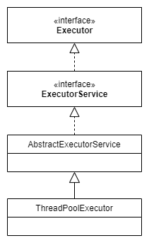

* content
{:toc}

线程池 (Thread Pool) 是一种基于池化的思想管理线程的工具。本文是基于JDK 1.8源码的Java线程池学习笔记

<!--more-->

## 为什么要使用线程池

- **降低资源消耗** 通过利用`已经创建的线程`，降低`创建和销毁线程`造成的消耗，提高系统资源利用率。
- **提高相应速度** 任务需要执行时，减少创建线程的时间消耗。
- **提高线程的可管理性** 线程是稀缺资源，如果无限制创建，不仅会消耗系统资源，还会因为线程的不合理分布导致资源调度失衡，降低系统的稳定性。使用线程池可以进行统一的`分配、调优和监控`。

## 如何使用线程池

### 创建ThreadPoolExecutor对象

在Java中通过创建 `ThreadPoolExecutor` 对象使用线程池。`Executors` 中也提供了几种创建线程池的静态方法，针对特定场景预置了构造参数。

``` java
public ThreadPoolExecutor(int corePoolSize,
                          int maximumPoolSize,
                          long keepAliveTime,
                          TimeUnit unit,
                          BlockingQueue<Runnable> workQueue,
                          ThreadFactory threadFactory,
                          RejectedExecutionHandler handler)
```

#### int corePoolSize

要保留在线程池中的线程数量，如果没有设置 `allowCoreThreadTimeOut` ，即使线程是空闲的，也不会被销毁。

如果提交一个任务，并且当前池中的线程数量小于 `corePoolSize`，即使池中有空闲线程可用，也会创建新的线程。

#### int maximumPoolSize

线程池中允许的最大线程数。

当阻塞队列已满，并且线程数小于 `maximumPoolSize`，会创建新的线程执行任务。

#### long keepAliveTime

当线程数量超过 `corePoolSize`，多余的空闲线程在终止前，等待新任务的最长时间。

#### TimeUnit unit

`keepAliveTime` 参数的时间单位，可选单位有DAYS、HOURS、MICROSECONDS、MILLISECONDS、MINUTES、NANOSECONDS、SECONDS。

#### BlockingQueue\<Runnable\> workQueue

当前线程数大于`corePoolSize` 并且小于 `maximumPoolSize`时，任务执行前会被保存在该阻塞队列中。

| 名称                  | 容量     | 描述                                                         |
| --------------------- | -------- | ------------------------------------------------------------ |
| ArrayBlockingQueue    | 有界     | 基于数组实现，按照先入先出(FIFO)原则对元素进行排序。支持公平锁和非公平锁。 |
| LinkedBlockingQueue   | 可选有界 | 由链表结构组成，按照先入先出(FIFO)原则对元素进行排序，默认长度为`Integer.MAX_VALUE`。 |
| PriorityBlockingQueue | 无界     | 支持线程优先级排序，默认自然序，不能保证同优先级元素的顺序。 |
| DelayQueue            | 无界     | 在 PriorityBlockingQueue 的基础上实现延迟获取，只有延时期满后的元素才能出队列。 |
| SynchronousQueue      | 0        | 不存储元素，每一个`put`操作必须等待另一个线程的`take`操作，否则添加操作一直处于阻塞状态。<br/>支持公平锁和非公平锁。 |
| LinkedTransferQueue   | 无界     | 由链表结构组成，相对于其它队列，多了 `transfer` 和 `tryTransfer` 方法 |
| LinkedBlockingDeque   | 可选有界 | 由链表结构组成的双向阻塞队列，默认长度为`Integer.MAX_VALUE`。<br/>队列头部和尾部都可以添加和移除元素，多线程并发时，可将锁竞争最多降到一半。 |

#### ThreadFactory threadFactory

创建线程时使用的工厂类。

#### RejectedExecutionHandler handler

当线程数量大于`maximumPoolSize`，或者线程池不在运行状态时，对提交的任务执行的拒绝策略。

JDK中预置的四种：

- **ThreadPoolExecutor.CallerRunsPolicy** 在调用者的线程中执行任务，如果调用者线程已经关闭，则直接丢弃任务。
- **ThreadPoolExecutor.AbortPolicy** 直接抛出`RejectedExecutionException`异常，**默认策略**。
- **ThreadPoolExecutor.DiscardPolicy** 直接丢弃任务。
- **ThreadPoolExecutor.DiscardOldestPolicy** 丢弃线程池将要执行的下一个任务，并执行当前任务。

### 任务的提交

使用`void execute(Runnable command)` 方法提交任务。

其余的带有返回值的 `submit()` 方法以及批量提交任务的方法，也是通过 `FutureTask` 完成的对 `execute()` 方法的封装。

### 线程池的关闭

可以调用以下两种方法关闭线程池：

- `void shutdown()` 已提交的任务会继续执行，停止接受新的任务。
- `List<Runnable> shutdownNow()` 尝试停止所有正在执行的任务，停止对等待队列中任务的分配执行，并返回等待执行的任务列表。<br>不能保证正在执行的线程一定会停止。例如，典型的实现将通过 `Thread.interrupt()` 取消，因此任何未能响应中断的任务可能永远不会终止。

当调用上述两种方法关闭线程池后，都会使 `boolean isShutdown()` 返回为 `true`。当线程池中所有的任务都关闭后，`boolean isTerminated()` 才会返回 `true`.

## 线程池的原理解析

先看一下ThreadPoolExecutor的类图：



- `Executor` 将任务提交和任务执行解耦。用户只需要提交实现了`Runnable`接口的任务运行逻辑，由执行器(`Executor`)负责线程的调配和任务的执行。
- `ExecutorService` 增加了一些能力
  1. 执行一个或者一批带有返回值 `Future` 的异步任务的能力。
  2. 管理线程池的关闭能力。
- `AbstractExecutorService` 抽象类，将执行任务的流程串联起来，其中带返回值 `Future` 的 `submit` 方法是通过 `FutureTask` 完成的对 `execute` 方法的封装，保证下层实现只需要关注一个执行任务方法。

### 生命周期管理

线程池的生命周期是内部维护的，并不对外暴漏。使用一个变量同时维护了运行状态 `runState` 和线程数量 `workerCount` 两个值。

``` java
private final AtomicInteger ctl = new AtomicInteger(ctlOf(RUNNING, 0));
private static final int COUNT_BITS = Integer.SIZE - 3;        // 高3位保存runState, 低29位保存workerCount
private static final int COUNT_MASK = (1 << COUNT_BITS) - 1;   // 0001 1111 1111 1111 1111 1111 1111 1111 用于位运算操作

// runState is stored in the high-order bits
private static final int RUNNING    = -1 << COUNT_BITS;
private static final int SHUTDOWN   =  0 << COUNT_BITS;
private static final int STOP       =  1 << COUNT_BITS;
private static final int TIDYING    =  2 << COUNT_BITS;
private static final int TERMINATED =  3 << COUNT_BITS;

// Packing and unpacking ctl
private static int runStateOf(int c)     { return c & ~COUNT_MASK; }  // 获取当前运行状态
private static int workerCountOf(int c)  { return c & COUNT_MASK; }   // 获取当前线程数量
private static int ctlOf(int rs, int wc) { return rs | wc; }          // 通过运行状态和线程数量生成 ctl
```

| 运行状态 runState | 状态描述                                                     |
| :---------------- | :----------------------------------------------------------- |
| RUNNING           | 能接受新提交的任务，并且也能处理阻塞队列中的任务。           |
| SHUTDOWN          | 关闭状态，不再接受新提交的任务，**但可以继续处理阻塞队列中已保存的任务**。 |
| STOP              | 不能接受新任务，也不处理队列中的任务，会中断正在处理任务的线程。 |
| TIDYING           | 当所有任务已经终止，有效线程数量 workerCount 为0，会变为TIDYING状态。 |
| TERMINATED        | 在`terminated()`方法执行后，线程池彻底终止，会变为TERMINATED状态。 |


### 提交任务的管理

当使用 `execute()` 提交一个任务到线程池中时，会有一下三种情况：

- 直接申请线程执行该任务。
- 缓冲到阻塞队列中等待线程执行。
- 拒绝该任务。

接下来，看一下 JDK 1.8 源码中是怎么处理的。

1. 如果 `workerCount < corePoolSize` 当前线程数小于核心线程数，执行`addWorker()`创建并启动一个线程来执行新提交的任务。注意：`addWorker()` 如果返回`false` 则直接返回。
2. 如果 `workerCount >= corePoolSize` 当前线程数大于等于核心线程数，且线程池内的阻塞队列未满，则将任务添加到该阻塞队列中。
3. 如果`workerCount >= corePoolSize && workerCount < maximumPoolSize` 当前线程数大于等于核心线程数但是小于设置的最大线程数，且线程池内的阻塞队列已满，则创建并启动一个线程来执行新提交的任务。
4. 如果`workerCount >= maximumPoolSize` 当前线程数大于等于设置的最大线程数，并且线程池内的阻塞队列已满, 则根据拒绝策略来处理该任务, 默认的处理方式是直接抛异常。

所以，大体上的流程是：

- 先创建核心线程执行任务；
- 然后放到阻塞队列中；
- 再然后允许创建临时的一些线程执行任务，但是不能超过设置的最大线程数；
- 最后，按照拒绝策略处理任务。


### 内部的线程的管理

### 线程池的监控管理

## 线程池的应用举例

